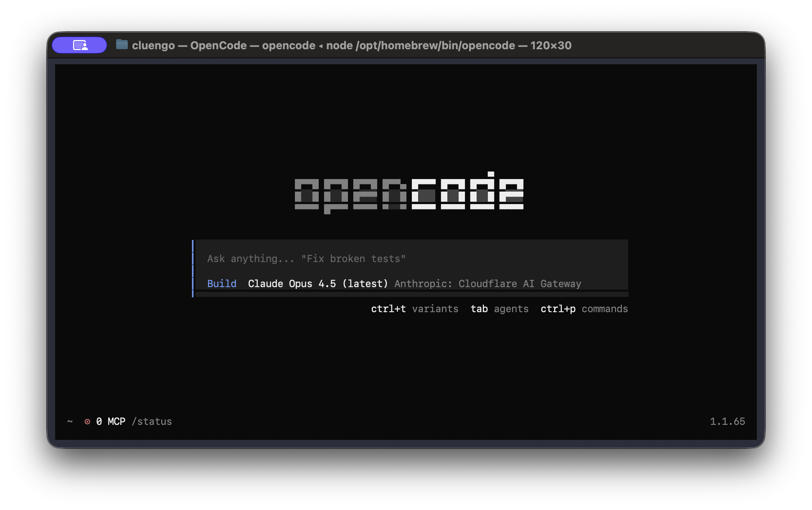
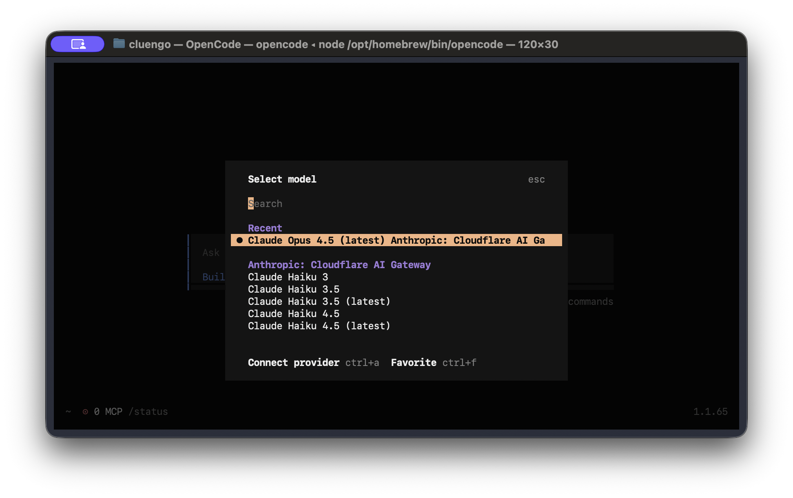
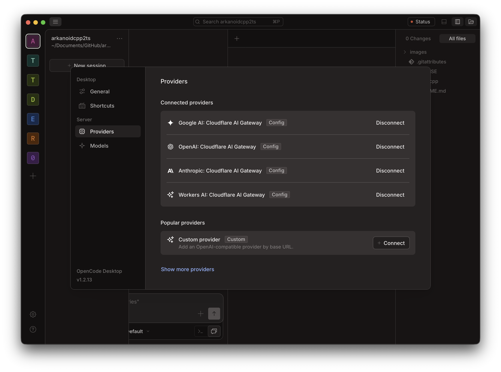
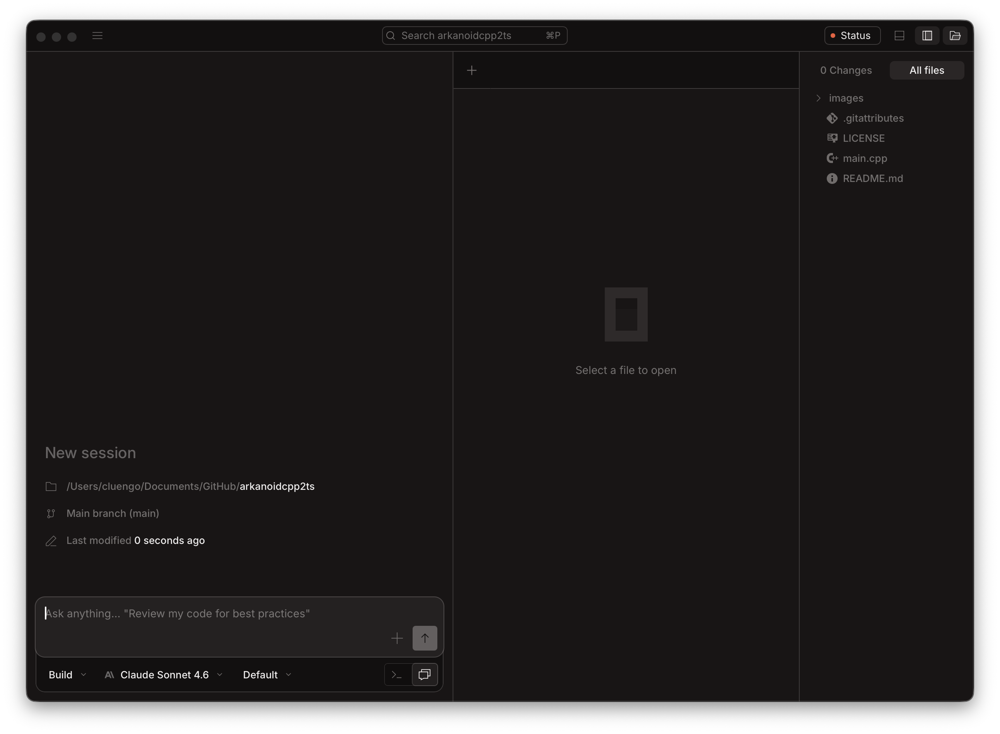
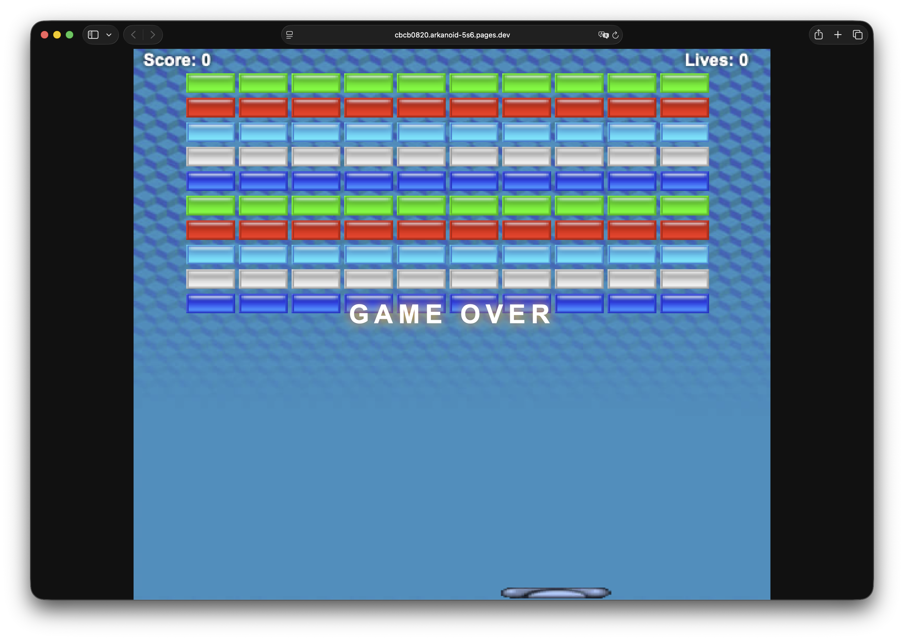

# Prompt de migración: Arkanoid C++ → TypeScript

> Prompt original utilizado para migrar el juego Arkanoid de C++/SFML a TypeScript/Canvas desplegado en Cloudflare Pages, ejecutado mediante **Vibe Coding** con [OpenCode](https://opencode.ai) + Claude Opus.

---

## Herramientas utilizadas

| Herramienta | Descripción |
|---|---|
| [OpenCode CLI](https://opencode.ai) | Agente de código en terminal (v1.1.65) |
| [OpenCode Desktop](https://opencode.ai) | Interfaz gráfica para sesiones de código (v1.2.13) |
| Claude Opus 4.5 (latest) | Modelo de IA vía Cloudflare AI Gateway |
| Cloudflare Pages | Hosting estático para el despliegue final |

### OpenCode CLI — Pantalla inicial



### OpenCode CLI — Selector de modelos



### OpenCode Desktop — Providers conectados (Cloudflare AI Gateway)



### OpenCode Desktop — Nueva sesión con el repositorio



---

## Prompt utilizado

```
Actúa como un Ingeniero de Software Principal y Experto en Desarrollo de Videojuegos,
especializado en C++, TypeScript, HTML5 Canvas y arquitecturas de despliegue en Cloudflare.

Tu objetivo es migrar de forma autónoma, completa y sin requerir intervención humana el juego
"Arkanoid" escrito en C++ (ubicado en este repositorio/directorio) a una aplicación web moderna
en TypeScript.


### 1. CONTEXTO Y PILA TECNOLÓGICA (TECH STACK)
- **Origen:** Código C++ (Lógica de juego, física, gestión de memoria manual, bucles nativos).
- **Destino:** TypeScript estricto (`strict: true`).
- **Renderizado:** HTML5 `<canvas>` API (o WebGL si la complejidad del C++ lo requiere,
  pero prefiere Canvas 2D para Arkanoid por simplicidad).
- **Entorno de Construcción:** Vite (rápido, moderno y compatible con TS).
- **Despliegue:** Cloudflare Pages (se requerirá configuración de build).


### 2. REGLAS ESTRICTAS DE AUTONOMÍA
- NO te detengas para pedirme permiso a menos que falte un archivo crítico.
- Analiza todos los archivos C++ del repositorio primero. Lee los `.h`, `.hpp` y `.cpp` para
  entender la arquitectura (entidades como Paddle, Ball, Bricks, GameState, Collision).
- Escribe, crea y modifica los archivos directamente en el entorno de trabajo.
- Si encuentras librerías de C++ (como SDL2, SFML o Raylib), abstrae sus llamadas y
  reemplázalas por sus equivalentes nativos en la Web (por ejemplo: eventos del DOM para inputs,
  `requestAnimationFrame` para el Game Loop, API de Audio Web para sonido).


### 3. PLAN DE EJECUCIÓN PASO A PASO (Ejecuta en orden):


**PASO 1: Análisis y Scaffold del Proyecto Web**
- Inicializa un nuevo proyecto con Vite y TypeScript puro (Vanilla TS).
- Crea el `package.json`, `tsconfig.json` (con modo estricto) y `vite.config.ts`.
- Instala las dependencias necesarias (`npm install` o el gestor que use el entorno).
- Crea un `index.html` con un `<canvas id="gameCanvas"></canvas>` que ocupe de manera
  responsiva el espacio de la ventana sin deformar el aspect ratio.


**PASO 2: Migración de Core y Entidades**
- Traduce las clases y structs de C++ a Clases o Interfaces de TypeScript.
- Implementa la física vectorial y la detección de colisiones (AABB, círculo-rectángulo)
  manteniendo la matemática exacta del C++ original.
- Tipa todo explícitamente. NO uses `any`.


**PASO 3: Game Loop y Control de Tiempo**
- En C++, el bucle probablemente use `while(running)` y cálculos con Delta Time.
- En TypeScript, implementa una clase `GameEngine` o similar que utilice
  `window.requestAnimationFrame`.
- Asegúrate de pasar el `deltaTime` en milisegundos a las funciones de actualización
  (`update(dt)`) para que la velocidad sea consistente independientemente de los FPS
  de la pantalla.


**PASO 4: Renderizado (Graphics) y Entradas (Input)**
- Mapea las funciones de dibujo de C++ al contexto 2D de Canvas
  (`ctx.fillRect`, `ctx.arc`, `ctx.drawImage`).
- Convierte el sistema de Input de C++ a Event Listeners de Javascript
  (`keydown`, `keyup`, `mousemove`). Guarda el estado de las teclas en un objeto/set
  global o dentro de la clase de Input.


**PASO 5: Preparación para Cloudflare**
- Crea un archivo `wrangler.toml` o las instrucciones necesarias para Cloudflare Pages.
- Asegúrate de que el comando de build de Vite (`npm run build`) deposita los archivos
  estáticos en la carpeta `dist`.
- Configura la salida del build para que sea compatible con el enrutamiento estático de
  Cloudflare.


### 4. INSTRUCCIÓN DE INICIO
Por favor, comienza ejecutando comandos de terminal o herramientas de lectura de archivos
para examinar el repositorio original en C++. Una vez que tengas el mapa mental de la
arquitectura original, procede con el "PASO 1" y avanza hasta que el juego compile en Vite
sin errores y esté listo para subir a Cloudflare.
```

---

## Resultado

El juego fue migrado, compilado y desplegado en Cloudflare Pages en una sola sesión de Vibe Coding:



**URL de deploy:** https://cbcb0820.arkanoid-5s6.pages.dev
